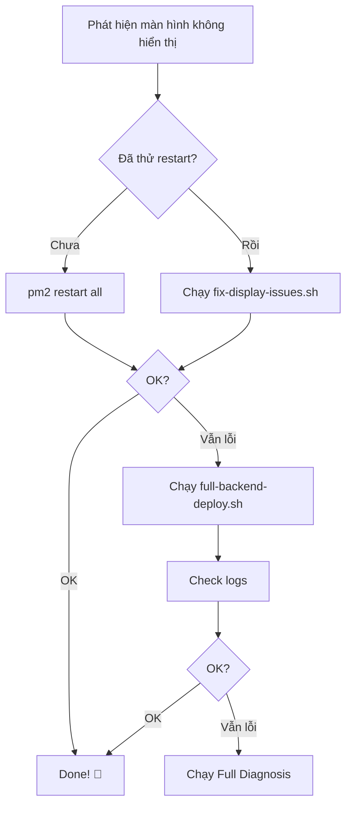

# 🩹 CÁCH SỬA LỖI MÀN HÌNH KHÔNG HIỂN THỊ

> **3 bước đơn giản để fix lỗi hiển thị dữ liệu**

---

## 🎯 Vấn đề

```
❌ Một số màn hình không hiển thị dữ liệu
❌ API trả về empty array []
❌ 404 hoặc 500 errors
```

---

## ✅ Giải pháp - Chọn 1 trong 3 cách

### 🥇 CÁCH 1: One-Click Fix (NHANH NHẤT)

```bash
cd /home/lta/pj/conttrade
bash scripts/deployment/one-click-deploy.sh
```

Khi menu hiện, **chọn: 4 (Fix Issues)**

```
╔════════════════════════════════════════╗
║  1) 🔥 Full Deploy                     ║
║  2) 🔧 Backend Only                    ║
║  3) 🎨 Frontend Only                   ║
║  4) 🩹 Fix Issues      ← CHỌN CÁI NÀY  ║
║  5) 🔍 Check Routes                    ║
║  6) 📊 Full Diagnosis                  ║
╚════════════════════════════════════════╝
```

⏱️ **Thời gian:** 3-5 phút  
✅ **Tự động:** Fix mọi vấn đề

---

### 🥈 CÁCH 2: Fix Script Trực Tiếp

```bash
cd /home/lta/pj/conttrade
bash scripts/deployment/fix-display-issues.sh
```

Script sẽ tự động:
1. ✅ Check backend
2. ✅ Test database  
3. ✅ Run migrations
4. ✅ Check permissions
5. ✅ Seed data (nếu cần)
6. ✅ Rebuild backend
7. ✅ Restart services

⏱️ **Thời gian:** 3-5 phút

---

### 🥉 CÁCH 3: Rebuild Backend Toàn Bộ

```bash
cd /home/lta/pj/conttrade
bash scripts/deployment/full-backend-deploy.sh
```

Deploy lại toàn bộ backend với tất cả routes:
1. ✅ Clean build
2. ✅ Install dependencies
3. ✅ Build tất cả routes
4. ✅ Start PM2
5. ✅ Test endpoints

⏱️ **Thời gian:** 5-10 phút

---

## 🔍 Sau khi fix, kiểm tra

```bash
# Kiểm tra routes
bash scripts/deployment/check-all-routes.sh

# Xem logs
pm2 logs

# Check status
pm2 status
```

---

## 📊 Đọc kết quả

Sau khi chạy check-all-routes.sh:

```
🎯 TÌNH TRẠNG TỔNG QUAN:
  ✅ EXCELLENT: 95% endpoints hoạt động tốt
```

**Giải thích:**
- ✅ **EXCELLENT (>90%)** = Perfect! Mọi thứ OK
- ⚠️ **GOOD (70-90%)** = Ổn, có vài lỗi nhỏ
- ❌ **POOR (<70%)** = Cần rebuild lại

---

## 🛠️ Nếu vẫn chưa fix được

### Bước 1: Chạy Full Diagnosis

```bash
bash scripts/deployment/one-click-deploy.sh
# Chọn: 6 (Full Diagnosis)
```

### Bước 2: Kiểm tra logs chi tiết

```bash
pm2 logs lta-backend --lines 200
```

### Bước 3: Restart tất cả

```bash
pm2 restart all
pm2 logs
```

### Bước 4: Test API trực tiếp

```bash
# Health check
curl http://localhost:3006/health

# Test endpoint cụ thể
curl http://localhost:3006/api/v1/depots
```

---

## 💡 Tips

### Xóa cache browser

```
Windows/Linux: Ctrl + Shift + R
Mac: Cmd + Shift + R
```

### Check network trong DevTools

1. Mở DevTools: `F12`
2. Tab **Network**
3. Refresh page
4. Xem request nào failed
5. Click để xem response

### Monitor real-time

```bash
pm2 monit
```

---

## 📚 Tài liệu chi tiết

Nếu cần hiểu sâu hơn:

- **`DEPLOY-FIX-GUIDE.md`** - Hướng dẫn chi tiết đầy đủ
- **`QUICK-DEPLOY-SOLUTION.txt`** - Quick reference
- **`SOLUTION-SUMMARY.md`** - Tóm tắt giải pháp

---

## 🎯 Workflow đề xuất



---

## 🆘 Cần giúp?

1. Chạy full diagnosis:
   ```bash
   bash scripts/deployment/one-click-deploy.sh
   # Chọn: 6
   ```

2. Capture output và logs:
   ```bash
   pm2 logs --lines 200 > logs.txt
   ```

3. Gửi kèm:
   - Output của diagnosis
   - File logs.txt
   - Screenshot lỗi trong browser DevTools

---

## ✅ Checklist

Sau khi fix, kiểm tra:

- [ ] `pm2 status` hiển thị "online"
- [ ] `pm2 logs` không có error
- [ ] `curl http://localhost:3006/health` trả về 200
- [ ] Browser console không có error
- [ ] Login thành công
- [ ] Các màn hình chính hiển thị dữ liệu

---

## 🎉 Hoàn tất!

Nếu đã pass checklist trên, mọi thứ đã OK! 🚀

**Lưu ý:** Nhớ xóa cache browser (Ctrl + Shift + R) để thấy thay đổi.

---

**Version:** 1.0.0  
**Date:** November 3, 2025  
**Team:** LTA Development
