# 🎨 SƠ ĐỒ TRỰC QUAN - LUỒNG LISTINGS HOÀN CHỈNH

**Ngày tạo:** 16/10/2025  
**Mục đích:** Visual diagrams cho toàn bộ luồng listings

---

## 📊 1. OVERVIEW FLOW (High-Level)

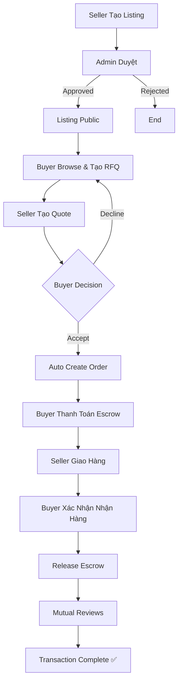

---

## 🔄 2. DETAILED SEQUENCE DIAGRAM

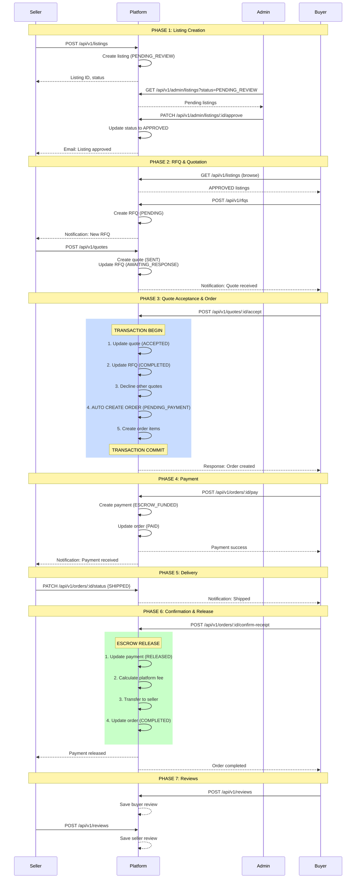

---

## 🎯 3. STATUS STATE MACHINE

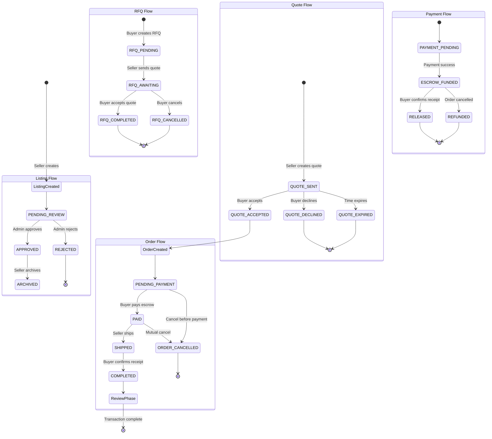

---

## 💾 4. DATABASE ER DIAGRAM

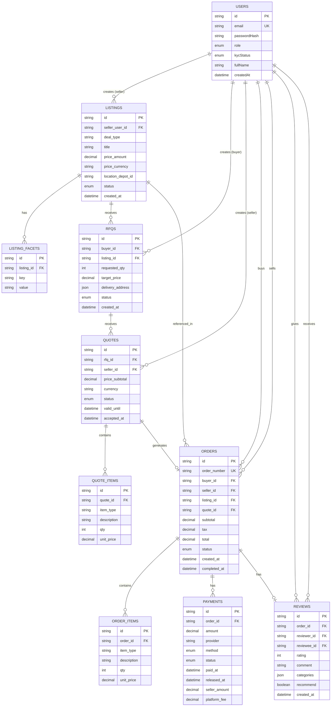

---

## 🔐 5. AUTHENTICATION & AUTHORIZATION FLOW

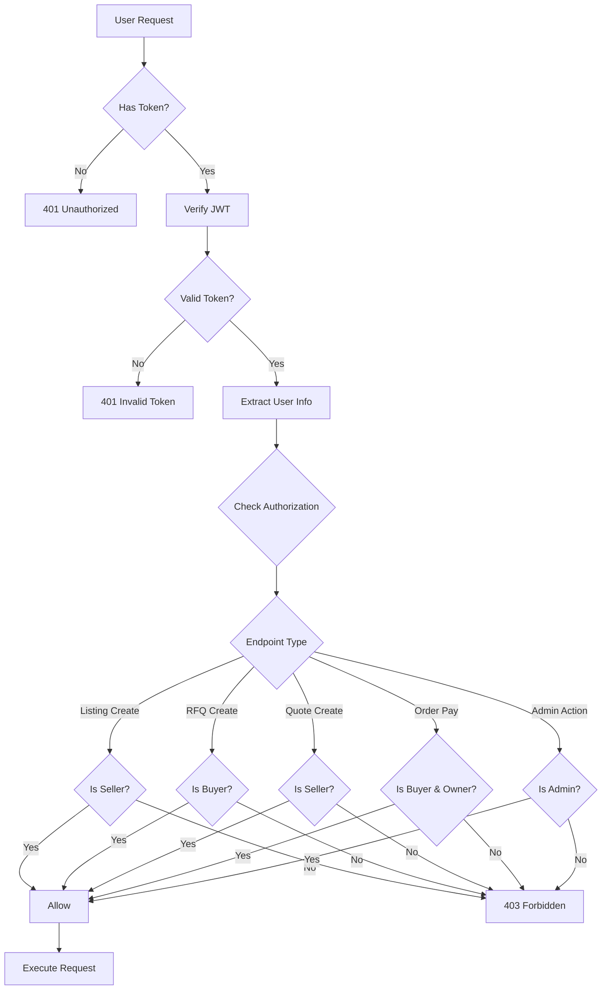

---

## 💰 6. PAYMENT & ESCROW FLOW

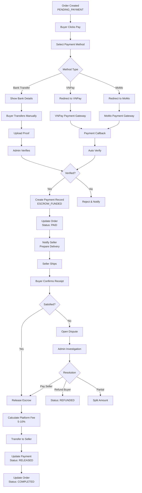

---

## 📱 7. USER JOURNEY MAP

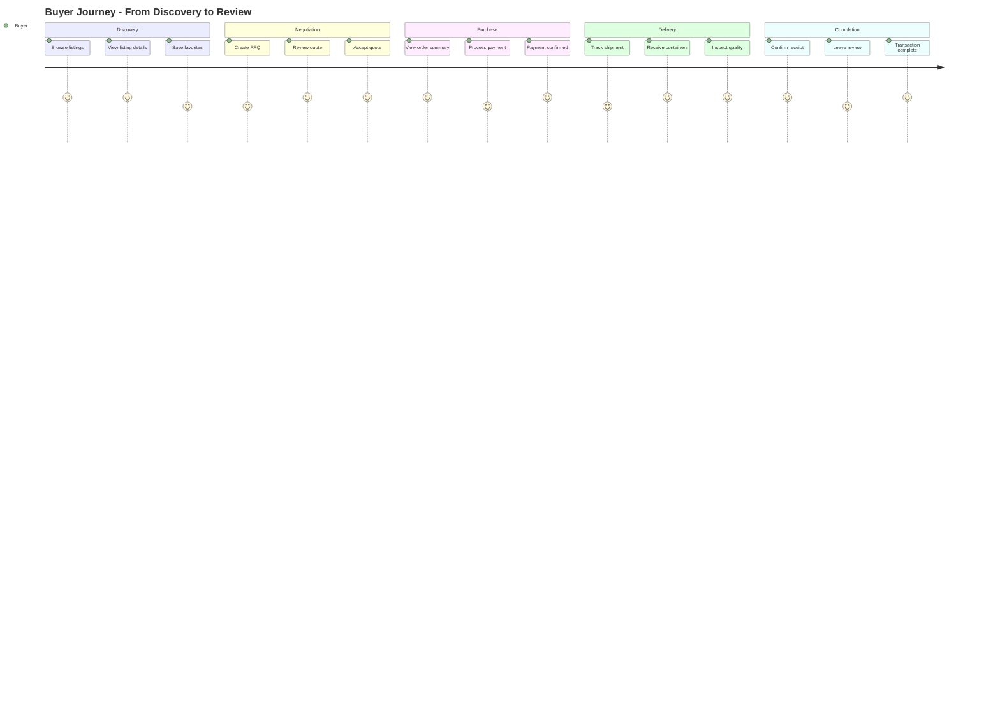

---

## ⚠️ 8. ERROR HANDLING FLOW

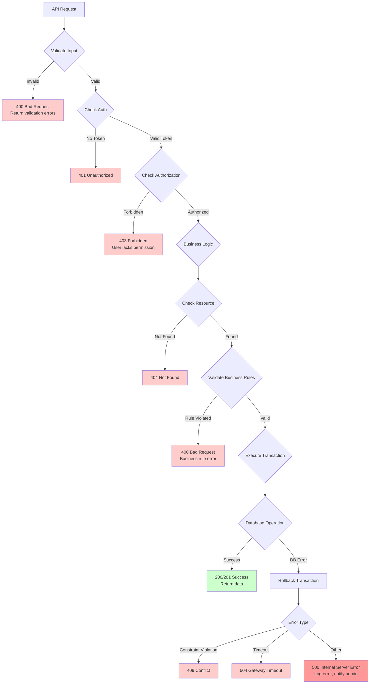

---

## 🔔 9. NOTIFICATION FLOW

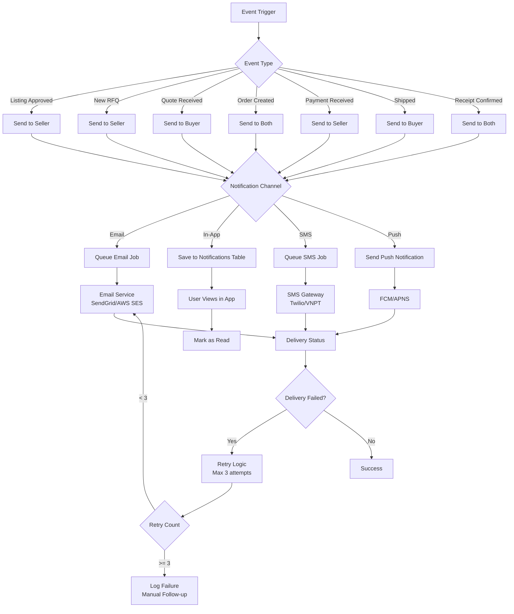

---

## 🧪 10. TESTING FLOW

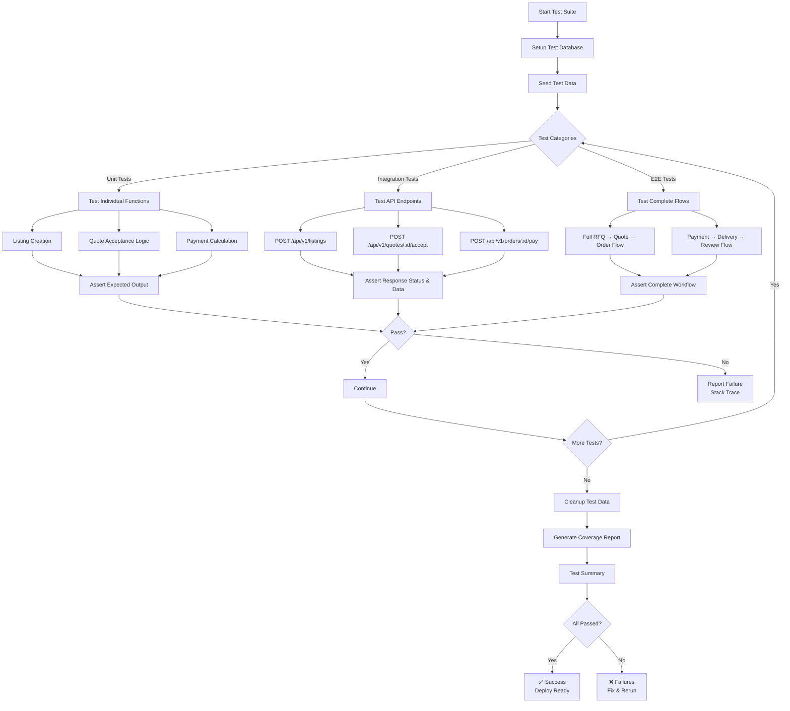

---

## 📊 11. METRICS & MONITORING

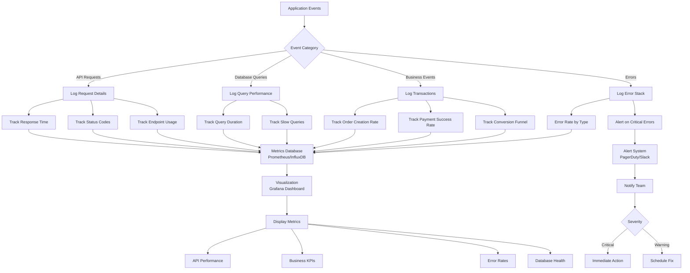

---

## 🎯 SUMMARY

### Flow Coverage
- ✅ 11 detailed diagrams
- ✅ All major workflows covered
- ✅ Technical & business perspectives
- ✅ Error handling & monitoring
- ✅ User journey mapping

### Diagram Types
1. **Overview Flow** - High-level process
2. **Sequence Diagram** - Detailed interactions
3. **State Machine** - Status transitions
4. **ER Diagram** - Database structure
5. **Auth Flow** - Security & permissions
6. **Payment Flow** - Escrow mechanism
7. **User Journey** - Experience mapping
8. **Error Handling** - Failure scenarios
9. **Notification Flow** - Communication channels
10. **Testing Flow** - Quality assurance
11. **Monitoring** - Observability

---

**© 2025 i-ContExchange Vietnam**  
**Created:** October 16, 2025  
**Format:** Mermaid Diagrams  
**Status:** ✅ Complete
